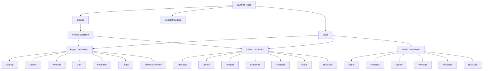

# IONE AlumaTech — Complete Migration Analysis

> **Prepared for:** Migration to Next.js (App Router) + Supabase + Clerk + Shadcn/ui + Tailwind CSS + Vercel
> **Current Stack:** Vanilla JS SPA, Firebase (Auth, Firestore, Realtime DB, Storage), Vite, HTML/CSS
> **Repository:** https://github.com/IONE-Kunming/aluminum-website

---

## Executive Summary

IONE AlumaTech is a **B2B aluminum and construction materials trading platform** with three user roles (Buyer, Seller, Admin). The current implementation is a single-page application built with vanilla JavaScript, Firebase backend services, and Vite as the build tool. The platform handles product catalogs, order management, invoicing, real-time chat, financial reporting, and multi-language support (English, Chinese, Arabic, Urdu).

**Key statistics:**
- **48 page modules** across 3 user roles + guest access
- **~25,000+ lines** of JavaScript
- **~9,200 lines** of CSS across 6 files
- **8 Firestore collections** + Realtime Database for chat
- **4 languages** with RTL support
- **6 finance modules** (transactions, accounts, reports, tax, reconciliation, dashboard)
- **Zero test suite** — no automated tests exist

**Migration Complexity: HIGH** — The application has deep Firebase integration, role-based access, real-time chat, PDF generation, and multi-language support that all need careful mapping to the new stack.

---

## Table of Contents

1. [Site Architecture Overview](#1-site-architecture-overview)
2. [Data Model Mapping](#2-data-model-mapping)
3. [Feature Inventory](#3-feature-inventory)
4. [UI Component Breakdown](#4-ui-component-breakdown)
5. [Authentication Flows](#5-authentication-flows)
6. [API Endpoints / Data Layer](#6-api-endpoints--data-layer)
7. [Business Logic](#7-business-logic)
8. [Third-Party Integrations](#8-third-party-integrations)
9. [Assets and Static Files](#9-assets-and-static-files)
10. [Performance Considerations](#10-performance-considerations)
11. [Edge Cases and Special Behaviors](#11-edge-cases-and-special-behaviors)
12. [Dependencies](#12-dependencies)
13. [Migration Recommendations](#13-migration-recommendations)

---

## 1. Site Architecture Overview

### 1.1 Application Type

Single-Page Application (SPA) with client-side routing via History API. All pages are JavaScript modules that render into a root `<div id="app">` element.

### 1.2 Route Structure

```
Public Routes (No Auth Required)
├── /                          → Landing page
├── /login                     → Login form
├── /signup                    → Registration form
├── /profile-selection         → Role selection (buyer/seller) after signup
├── /guest/categories          → Guest category browsing
├── /guest/catalog             → Guest product catalog
├── /guest/product             → Guest product detail
└── /categories                → Backward compat redirect

Buyer Routes (/buyer/*)
├── /buyer/dashboard           → Buyer dashboard with stats
├── /buyer/category-selection  → Category browsing entry
├── /buyer/catalog             → Product catalog (hierarchical)
├── /buyer/all-products        → Flat product listing
├── /buyer/product             → Product detail with dimensions
├── /buyer/cart                → Shopping cart
├── /buyer/checkout            → Deposit & payment selection
├── /buyer/order-checkout      → Process payment for order
├── /buyer/orders              → Order listing & tracking
├── /buyer/invoices            → Invoice listing
├── /buyer/sellers             → Seller directory
├── /buyer/support             → Support contact form
├── /buyer/notifications       → Activity notifications
├── /buyer/profile             → Account settings
├── /buyer/chats               → Messaging with sellers
├── /buyer/finances/dashboard  → Financial overview
├── /buyer/finances/transactions → Transaction ledger
├── /buyer/finances/accounts   → Chart of accounts
├── /buyer/finances/reports    → Financial reports
├── /buyer/finances/tax        → Tax management
└── /buyer/finances/reconciliation → Bank reconciliation

Seller Routes (/seller/*)
├── /seller/dashboard          → Seller dashboard with stats
├── /seller/products           → Product management (CRUD)
├── /seller/orders             → Incoming order management
├── /seller/invoices           → Invoice management
├── /seller/branches           → Branch/location management
├── /seller/support            → Support contact
├── /seller/notifications      → Activity notifications
├── /seller/profile            → Account + payment settings
├── /seller/chats              → Messaging with buyers
├── /seller/bulk-edit          → Bulk product editor
├── /seller/finances/dashboard
├── /seller/finances/transactions
├── /seller/finances/accounts
├── /seller/finances/reports
├── /seller/finances/tax
└── /seller/finances/reconciliation

Admin Routes (/admin/*)
├── /admin/dashboard           → Platform overview stats
├── /admin/users               → User management
├── /admin/products            → All products management
├── /admin/orders              → All orders management
├── /admin/invoices            → All invoices management
├── /admin/bulk-edit           → Bulk product editor
├── /admin/support             → Support management
├── /admin/profile             → Admin profile
├── /admin/finances/dashboard
├── /admin/finances/transactions
├── /admin/finances/accounts
├── /admin/finances/reports
├── /admin/finances/tax
└── /admin/finances/reconciliation

Shared Routes
└── /order/detail?id=...       → Order detail (buyer + seller)
```

### 1.3 Navigation Hierarchy



### 1.4 Layout Components

| Component | File | Description |
|-----------|------|-------------|
| **Sidebar** | `layout.js` | Role-based navigation menu, logo, theme toggle, language switcher, user info |
| **Header** | `layout.js` (mobile) | Mobile menu toggle button |
| **Cart Overlay** | `layout.js` | Floating cart widget (buyer catalog page only, top 3 items) |
| **Toast Container** | `index.html` | Global notification toasts (success, error, info) |
| **Landing Header** | `landing.js` | Public navigation with language dropdown and auth links |
| **Landing Footer** | `landing.js` | Site-wide footer with nav links |

### 1.5 Public vs Authenticated Areas

| Area | Auth Required | Role Required |
|------|--------------|---------------|
| Landing, Login, Signup | No | None |
| Guest catalog/categories/product | No | None |
| Profile Selection | Yes | None |
| Buyer pages (`/buyer/*`) | Yes | `buyer` |
| Seller pages (`/seller/*`) | Yes | `seller` |
| Admin pages (`/admin/*`) | Yes | `admin` |
| Order Detail (`/order/detail`) | Yes | Any (buyer or seller of that order) |

**Protection Mechanism:** `protectedRoute(handler, requireRole)` wrapper waits for auth state (5s timeout), then profile load (8s timeout), validates role, and redirects to `/login` on failure.

---

## 2. Data Model Mapping

### 2.1 Firestore Collections

#### `users` Collection

| Field | Type | Required | Notes |
|-------|------|----------|-------|
| `uid` | string (doc ID) | Yes | Firebase Auth UID |
| `email` | string | Yes | User email |
| `displayName` | string | Yes | Full name |
| `role` | string | Yes | `admin` \| `seller` \| `buyer` |
| `company` | string | Yes | Company name |
| `phoneNumber` | string | Yes | International format with country code |
| `preferredLanguage` | string | No | `en` \| `zh` \| `ar` \| `ur` |
| `address.street` | string | No | Street address |
| `address.city` | string | No | City |
| `address.state` | string | No | State/Province |
| `address.zip` | string | No | Postal code |
| `address.country` | string | No | Country |
| `bankName` | string | Seller only | Bank name |
| `accountName` | string | Seller only | Account holder |
| `accountNumber` | string | Seller only | Account/IBAN number |
| `swiftCode` | string | Seller only | SWIFT/BIC code |
| `bankBranch` | string | Seller only | Branch/City |
| `currency` | string | Seller only | `USD`\|`CNY`\|`EUR`\|`GBP`\|`AED`\|`SAR`\|`PKR` |
| `paymentNotes` | string | Seller only | Additional notes |
| `createdAt` | timestamp | Yes | Registration date |
| `updatedAt` | timestamp | Yes | Last update |

**Relationships:** Referenced by `orders.buyerId`, `orders.sellerId`, `products.sellerId`, `invoices.buyerId`, `invoices.sellerId`, `branches.sellerId`, `notifications.userId`

#### `products` Collection

| Field | Type | Required | Notes |
|-------|------|----------|-------|
| `id` | string (doc ID) | Yes | Auto-generated |
| `sellerId` | string | Yes | Reference to users.uid |
| `sellerName` | string | Yes | Denormalized seller name |
| `name` | string | Yes | Product name |
| `modelNumber` | string | Yes | Model/SKU number |
| `mainCategory` | string | Yes | Top-level category |
| `category` | string | Yes | Subcategory |
| `subcategory` | string | No | Additional subcategory level |
| `pricePerMeter` | number | Yes | Unit price in USD |
| `description` | string | No | Product description |
| `stock` | number | Yes | Available quantity |
| `stockStatus` | string | No | `available` \| `unavailable` |
| `imageUrl` | string | No | Primary image URL (Firebase Storage) |
| `additionalImages` | array\<string\> | No | Extra image URLs |
| `isActive` | boolean | Yes | Active listing flag |
| `createdAt` | timestamp | Yes | Creation date |
| `updatedAt` | timestamp | Yes | Last update |

**Relationships:** Referenced by `orders.items[].productId`, `carts.items[].productId`

#### `orders` Collection

| Field | Type | Required | Notes |
|-------|------|----------|-------|
| `id` | string (doc ID) | Yes | Auto-generated |
| `buyerId` | string | Yes | Reference to users.uid |
| `buyerName` | string | Yes | Denormalized |
| `buyerEmail` | string | Yes | Denormalized |
| `buyerCompany` | string | Yes | Denormalized |
| `buyerAddress` | object | Yes | Full address object |
| `sellerId` | string | Yes | Reference to users.uid |
| `items` | array\<OrderItem\> | Yes | See sub-schema below |
| `subtotal` | number | Yes | Pre-tax total |
| `tax` | number | Yes | Tax amount |
| `taxRate` | number | Yes | Tax percentage (0.10 = 10%) |
| `total` | number | Yes | Final total with tax |
| `depositAmount` | number | Yes | Deposit paid |
| `depositPercentage` | number | Yes | Deposit % (5/30/65/100) |
| `remainingBalance` | number | Yes | Unpaid amount |
| `paymentMethod` | string | Yes | `alipay`\|`wechat`\|`bank_transfer`\|`card` |
| `paymentStatus` | string | Yes | `pending`\|`deposit_paid`\|`paid` |
| `status` | string | Yes | See order statuses below |
| `createdAt` | timestamp | Yes | Order date |
| `updatedAt` | timestamp | Yes | Last update |

**OrderItem Sub-schema:**

| Field | Type |
|-------|------|
| `productId` | string |
| `name` | string |
| `modelNumber` | string |
| `category` | string |
| `quantity` | number |
| `price` | number |
| `pricePerMeter` | number |
| `imageUrl` | string |

**Order Statuses:** `draft` → `pending` → `processing` → `shipped` → `delivered` | `cancelled`

**Seller-visible Statuses:** Under Review, Confirmed, In Production, Ready for Shipment, Shipped, Delivered, Ready for Collection

#### `invoices` Collection

| Field | Type | Required | Notes |
|-------|------|----------|-------|
| `id` | string (doc ID) | Yes | Auto-generated |
| `invoiceNumber` | string | Yes | Format: `INV-YYYY-XXXXX` |
| `orderId` | string | Yes | Reference to orders.id |
| `buyerId` | string | Yes | Reference to users.uid |
| `buyerName` | string | Yes | Denormalized |
| `buyerEmail` | string | Yes | Denormalized |
| `buyerCompany` | string | Yes | Denormalized |
| `buyerAddress` | object | Yes | Full address |
| `sellerId` | string | Yes | Reference to users.uid |
| `sellerName` | string | Yes | Denormalized |
| `sellerEmail` | string | Yes | Denormalized |
| `sellerCompany` | string | Yes | Denormalized |
| `sellerAddress` | object | Yes | Full address |
| `items` | array | Yes | Same as order items |
| `subtotal` | number | Yes | Pre-tax |
| `tax` | number | Yes | Tax amount |
| `total` | number | Yes | Final total |
| `depositPaid` | number | Yes | Deposit amount |
| `remainingBalance` | number | Yes | Outstanding |
| `paymentTerms` | string | Yes | Payment terms text |
| `paymentInstructions` | object | Yes | Bank details for payment |
| `termsAndConditions` | array\<string\> | Yes | T&C clauses |
| `status` | string | Yes | `issued`\|`paid`\|`overdue`\|`cancelled` |
| `dueDate` | timestamp | Yes | Payment due date |
| `paidAt` | timestamp | No | When fully paid |
| `notes` | string | No | Additional notes |
| `createdAt` | timestamp | Yes | Issue date |
| `updatedAt` | timestamp | Yes | Last update |

**Invoice Number Generation:** Thread-safe using Firestore transaction on `_counters/invoices` document. Format `INV-{YEAR}-{SEQUENCE}` with zero-padded 5-digit sequence, resets yearly.

#### `carts` Collection

| Field | Type | Required | Notes |
|-------|------|----------|-------|
| (doc ID = userId) | string | Yes | User's UID as document ID |
| `items` | array | Yes | `[{ productId, quantity, price }]` |
| `updatedAt` | timestamp | Yes | Last modification |

#### `notifications` Collection

| Field | Type | Required | Notes |
|-------|------|----------|-------|
| `id` | string (doc ID) | Yes | Auto-generated |
| `userId` | string | Yes | Target user |
| `type` | string | Yes | `chat`\|`order`\|`payment`\|`system` |
| `title` | string | Yes | Notification title |
| `message` | string | Yes | Notification body |
| `read` | boolean | Yes | Read status |
| `senderId` | string | No | For chat notifications |
| `createdAt` | timestamp | Yes | Creation date |

#### `branches` Collection

| Field | Type | Required | Notes |
|-------|------|----------|-------|
| `id` | string (doc ID) | Yes | Auto-generated |
| `sellerId` | string | Yes | Reference to users.uid |
| `name` | string | Yes | Branch name (2-100 chars) |
| `address` | string | Yes | Street address (5+ chars) |
| `city` | string | Yes | City (2+ chars) |
| `state` | string | No | State/Province |
| `country` | string | Yes | Country (2+ chars) |
| `phone` | string | No | Phone (7-15 digits) |
| `email` | string | No | Contact email |
| `createdAt` | timestamp | Yes | Creation date |
| `updatedAt` | timestamp | Yes | Last update |

#### `support` Collection

| Field | Type | Required | Notes |
|-------|------|----------|-------|
| `id` | string (doc ID) | Yes | Auto-generated |
| `userId` | string | Yes | Submitter UID |
| `type` | string | Yes | Support type |
| `subject` | string | Yes | Issue subject |
| `message` | string | Yes | Issue description |
| `status` | string | Yes | Ticket status |
| `createdAt` | timestamp | Yes | Submission date |
| `updatedAt` | timestamp | Yes | Last update |

#### `_counters` Collection (Internal)

| Document | Field | Type | Notes |
|----------|-------|------|-------|
| `invoices` | `lastNumber` | number | Last used sequence |
| `invoices` | `year` | number | Current year (resets sequence) |
| `invoices` | `updatedAt` | timestamp | Last generation time |

### 2.2 Firebase Realtime Database (Chat)

```
conversations/
  {conversationId}/           # ID format: productId_buyerUid_sellerUid
    productId: string
    buyerId: string
    sellerId: string
    lastMessage: string
    lastMessageTime: timestamp
    createdAt: timestamp

messages/
  {conversationId}/
    {messageId}/
      senderId: string
      text: string             # For text messages
      type: "text" | "image" | "pdf"
      fileUrl: string          # For file messages
      fileName: string         # Original filename
      timestamp: timestamp

userConversations/
  {uid}/
    {conversationId}/
      conversationId: string
      otherUserId: string
      otherUserName: string
      productId: string
      lastMessage: string
      lastMessageTime: timestamp
```

### 2.3 Composite Indexes (Firestore)

| Collection | Fields | Direction |
|-----------|--------|-----------|
| orders | buyerId ASC, createdAt DESC | Query: buyer's orders |
| orders | sellerId ASC, createdAt DESC | Query: seller's orders |
| orders | status ASC, createdAt DESC | Query: orders by status |
| notifications | userId ASC, createdAt DESC | Query: user notifications |
| invoices | buyerId ASC, createdAt DESC | Query: buyer invoices |
| invoices | sellerId ASC, createdAt DESC | Query: seller invoices |
| products | sellerId ASC, createdAt DESC | Query: seller products |

### 2.4 Entity Relationship Diagram

```
┌──────────┐       ┌───────────┐       ┌──────────┐
│  users   │───1:N─│ products  │       │ branches │
│  (uid)   │       │(sellerId) │       │(sellerId)│
└────┬─────┘       └─────┬─────┘       └──────────┘
     │                    │
     │  ┌─────────────────┘
     │  │
┌────┴──┴──┐       ┌───────────┐
│  orders  │──1:1──│ invoices  │
│(buyerId, │       │ (orderId) │
│ sellerId)│       └───────────┘
└────┬─────┘
     │
┌────┴─────┐       ┌──────────────┐
│  carts   │       │notifications │
│ (userId) │       │  (userId)    │
└──────────┘       └──────────────┘

┌──────────────────────────────────────┐
│     Firebase Realtime Database       │
│  conversations ── messages           │
│  userConversations (per user index)  │
└──────────────────────────────────────┘
```

### 2.5 Estimated Data Volume

Based on emulator seed data and platform metrics shown on landing page:
- **Users:** 1,000+ (claimed on landing page)
- **Products:** 200,000+ (pagination designed for this scale)
- **Orders:** Thousands (paginated with 10/page default)
- **Invoices:** One per order (after deposit payment)
- **Chat messages:** 50 per conversation (hard limit)
- **Branches:** Low volume (few per seller)
- **Notifications:** Unbounded (per-user, no cleanup)

---

## 3. Feature Inventory

### 3.1 Public Features

| # | Feature | Route | Description | Data Dependencies | Third-Party |
|---|---------|-------|-------------|-------------------|-------------|
| 1 | Landing Page | `/` | Marketing page with platform stats, features, categories, CTA | Category hierarchy | None |
| 2 | Login | `/login` | Email/password + Google OAuth sign-in | Firebase Auth | Google OAuth |
| 3 | Signup | `/signup` | Registration with role selection (buyer/seller) | Firebase Auth, Firestore users | None |
| 4 | Profile Selection | `/profile-selection` | Post-signup role selection | Firestore users | None |
| 5 | Guest Categories | `/guest/categories` | Browse categories without login | Category hierarchy | None |
| 6 | Guest Catalog | `/guest/catalog` | Browse products without login (with signup CTA) | Firestore products | None |
| 7 | Guest Product Detail | `/guest/product` | View product detail without login | Firestore products | None |

### 3.2 Buyer Features

| # | Feature | Route | Roles | Description | Data Dependencies |
|---|---------|-------|-------|-------------|-------------------|
| 8 | Buyer Dashboard | `/buyer/dashboard` | buyer | Stats overview (orders, spending) + recent orders | orders, dashboard stats |
| 9 | Category Selection | `/buyer/category-selection` | buyer | Visual category grid entry | Category hierarchy |
| 10 | Product Catalog | `/buyer/catalog` | buyer | Hierarchical browsing: Category → Subcategory → Seller → Products | products, users (sellers) |
| 11 | All Products | `/buyer/all-products` | buyer | Flat product grid with search & pagination | products |
| 12 | Product Detail | `/buyer/product` | buyer | Full product view with dimensions, image zoom, add to cart, chat with seller | products, cart |
| 13 | Shopping Cart | `/buyer/cart` | buyer | Cart management with quantity controls, validation | carts, products |
| 14 | Checkout | `/buyer/checkout` | buyer | Deposit selection (5/30/65/100%), payment method, order creation | carts, orders |
| 15 | Order Checkout | `/buyer/order-checkout` | buyer | Process payment on draft order or remaining balance | orders, invoices |
| 16 | Orders | `/buyer/orders` | buyer | Order listing with draft/active split, search, date filter | orders |
| 17 | Invoices | `/buyer/invoices` | buyer | Invoice listing with balance tracking | invoices |
| 18 | Sellers Directory | `/buyer/sellers` | buyer | Browse sellers, filter by category, search, view products, start chat | users, products |
| 19 | Support | `/buyer/support` | buyer | Contact form → generates mailto: link | None (email client) |
| 20 | Notifications | `/buyer/notifications` | buyer | Activity feed (orders, payments, chats) | notifications |
| 21 | Profile | `/buyer/profile` | buyer | Account settings, phone with country code | users |
| 22 | Chats | `/buyer/chats` | buyer | Real-time messaging with sellers, file sharing | RTDB (chat) |
| 23 | Finance Dashboard | `/buyer/finances/dashboard` | buyer | Revenue, profit, expenses, tax overview | orders, invoices |
| 24 | Transactions | `/buyer/finances/transactions` | buyer | Ledger view with debit/credit, CSV export | orders |
| 25 | Accounts | `/buyer/finances/accounts` | buyer | Chart of accounts management | Local (11 default accounts) |
| 26 | Reports | `/buyer/finances/reports` | buyer | 10 report types (P&L, Balance Sheet, etc.) | orders, invoices |
| 27 | Tax | `/buyer/finances/tax` | buyer | Multi-jurisdiction tax management | orders |
| 28 | Reconciliation | `/buyer/finances/reconciliation` | buyer | Bank statement upload & matching | orders |

### 3.3 Seller Features

| # | Feature | Route | Roles | Description |
|---|---------|-------|-------|-------------|
| 29 | Seller Dashboard | `/seller/dashboard` | seller | Products, orders, revenue stats + top products |
| 30 | Product Management | `/seller/products` | seller | Full CRUD: add/edit/delete products, bulk import CSV, image upload |
| 31 | Bulk Edit | `/seller/bulk-edit` | seller | Table-based multi-product editor with image management |
| 32 | Seller Orders | `/seller/orders` | seller | Incoming orders management with status filtering |
| 33 | Seller Invoices | `/seller/invoices` | seller | Invoice tracking and management |
| 34 | Branches | `/seller/branches` | seller | Multi-location management (CRUD) |
| 35 | Seller Profile | `/seller/profile` | seller | Account settings + bank/payment details |
| 36 | Seller Chats | `/seller/chats` | seller | Messaging with buyers |
| 37-42 | Finance modules | `/seller/finances/*` | seller | Same as buyer finance modules |

### 3.4 Admin Features

| # | Feature | Route | Roles | Description |
|---|---------|-------|-------|-------------|
| 43 | Admin Dashboard | `/admin/dashboard` | admin | Platform-wide stats (users, orders, revenue, sellers) |
| 44 | User Management | `/admin/users` | admin | Search/filter users, import profiles, export user data |
| 45 | Product Management | `/admin/products` | admin | All products with seller filter |
| 46 | Admin Bulk Edit | `/admin/bulk-edit` | admin | Bulk product editor (all sellers) |
| 47 | Admin Orders | `/admin/orders` | admin | All platform orders |
| 48 | Admin Invoices | `/admin/invoices` | admin | All platform invoices |
| 49 | Admin Support | `/admin/support` | admin | All support tickets |
| 50-55 | Finance modules | `/admin/finances/*` | admin | Platform-wide financial management |

### 3.5 Shared Features

| # | Feature | Route | Description |
|---|---------|-------|-------------|
| 56 | Order Detail | `/order/detail?id=` | Full order view (buyer sees order, seller can update status) |
| 57 | Invoice Detail | Any invoice view | Multi-language invoice with PDF/CSV/TXT export |
| 58 | Theme Toggle | Sidebar | Dark/light theme switching (persisted in localStorage) |
| 59 | Language Switcher | Sidebar + Landing | EN/ZH/AR/UR with RTL support |
| 60 | Toast Notifications | Global | Success/error/info feedback |

---

## 4. UI Component Breakdown

### 4.1 Global Layout Components

| Component | Location | Responsive | Notes |
|-----------|----------|------------|-------|
| **Sidebar Navigation** | All authenticated pages | Collapses on mobile with hamburger | Role-specific menu items |
| **Mobile Overlay** | Mobile only | Click to close sidebar | Semi-transparent backdrop |
| **Cart Overlay Widget** | Buyer catalog page | Floating bottom-right | Shows top 3 items |
| **Toast Container** | Global | Fixed position | Animated notifications |
| **Confirmation Modal** | On-demand | Centered overlay | Custom labels per context |

### 4.2 Page-Specific Components

#### Landing Page (`landing.js`)
- Navigation bar with logo, language dropdown, Login/Signup buttons
- Hero section with stats (1000+ users, $50M+ transactions, 99.9% uptime)
- 6 feature cards (icons from Lucide)
- Category grid (up to 8 categories from hierarchy)
- 3-step "How It Works" section
- Benefits section with metrics
- CTA section
- Footer with navigation columns

#### Login Page (`login.js`)
- Email input field (type=email, required)
- Password input field (type=password, required)
- "Login" submit button with loading state
- "Sign in with Google" button with loading state
- Language dropdown
- Link to signup page
- Error message display area

#### Signup Page (`signup.js`)
- Role selection radio group (Buyer/Seller)
- Display Name text input (required)
- Company Name text input (required)
- Email input (required)
- Phone Number input (required)
- Password input (required, min 6 chars)
- Submit button with loading state
- Link to login page

#### Product Catalog (`catalog.js`)
- **Category Grid View:** Cards with category name + product count
- **Subcategory Grid View:** Cards with subcategory name
- **Seller Grid View:** Seller cards with avatar, name, company, product count
- **Product Grid View:** Product cards with image, name, model#, category tag, price, stock, "Add to Cart" button
- Search input (real-time filtering)
- Breadcrumb navigation (Category > Subcategory > Seller)
- Pagination controls (Previous/Next, page numbers, 12 items/page)

#### Shopping Cart (`cart.js`)
- Cart item rows: image, name, model#, price, quantity controls (±/input), remove button, subtotal
- Order summary panel: subtotal, tax (10%), total
- Empty cart message with CTA
- Checkout button (disabled if items unavailable)
- Continue shopping link

#### Checkout (`checkout.js`)
- Order summary (items, subtotal, tax, total)
- Deposit selection buttons: 5%, 30%, 65%, 100%
- Deposit/remaining balance calculation display
- Payment method selection: Alipay, WeChat Pay, Bank Transfer, Card
- Confirm button (disabled until both selected)
- Mock payment processing overlay

#### Order Detail (`order-detail.js`)
- Order header: ID, status badge, date
- Customer info section
- Items table: product, model#, quantity, unit price, subtotal
- Payment summary: subtotal, tax, total, deposit (with %), remaining
- Status dropdown (seller only, 7 options)

#### Invoice Detail (`invoice-detail.js`)
- Language switcher dropdown (translates invoice on page)
- Invoice header: logo, date, invoice#, status
- Seller details section
- Buyer details section
- Payment instructions (bank details)
- Items table: product name, dimensions, qty, unit, price, subtotal
- Totals: subtotal, tax, total, deposit paid, balance due
- Terms & conditions
- Export buttons: PDF, CSV, TXT
- Print button

#### Product Management (`products.js` — Seller)
- Product grid with search and category filter
- Add Product modal: model#, main category, subcategory, price, stock, description, image upload
- Edit Product modal: all fields + additional images upload
- Bulk Import button (CSV upload)
- Bulk Edit / Table Edit navigation buttons
- Bulk delete with checkbox selection

#### Admin Users (`admin-users.js`)
- Search by name/email
- Filter by role dropdown
- Filter by status dropdown
- User table: name, email, role, company, status, actions
- Import profile functionality
- Export user profile (complete data dump with products, orders, invoices, financial summary)

#### Chat (`chat.js`)
- Conversation sidebar: user avatar, name, last message, timestamp
- Message area: bubbles with sender alignment (left/right)
- Message input: text field + file upload button + send button
- File upload: progress bar, image/PDF preview
- Mobile: toggle between sidebar and chat view

#### Finance Dashboard (`finances-dashboard.js`)
- 4 metric cards: revenue, profit, expenses, tax liability
- Monthly trends chart (text-based)
- Revenue by category breakdown

#### Finance Transactions (`finances-transactions.js`)
- Search input
- Type filter (sale/refund/expense)
- Status filter (completed/pending/cancelled)
- Transaction table: date, reference, description, account, debit, credit, status
- Export CSV button
- Pagination (50 items max)

#### Branches (`branches.js`)
- Branch card grid (3 columns responsive)
- Add Branch modal: name, address, city, state, country, phone, email
- Edit/Delete buttons per card
- Duplicate name prevention

### 4.3 Reusable UI Patterns

| Pattern | Usage |
|---------|-------|
| **Stat Card** | Dashboard pages (4 cards with icon, label, value) |
| **Data Table** | Orders, invoices, transactions, users, products |
| **Modal Dialog** | Add/edit product, add/edit branch, confirmations |
| **Status Badge** | Order status, invoice status, payment status |
| **Search + Filter Bar** | Most listing pages (text search + dropdown filters) |
| **Pagination Controls** | Product lists, order lists (page numbers + prev/next) |
| **Empty State** | Cart, orders, notifications (icon + message + CTA) |
| **Loading State** | Data fetch with skeleton or "Loading..." text |
| **Form Validation** | Inline error messages, button disable on invalid |
| **Card Grid** | Products, categories, sellers, branches |
| **Image Upload** | Product images, profile pictures, chat files |
| **Currency Display** | Intl.NumberFormat USD formatting |
| **Date Display** | "MMM DD, YYYY" format via Firestore timestamp |

### 4.4 Animations and Transitions

- Toast notifications: slide-in animation
- Modal dialogs: fade-in
- Theme toggle: CSS transition on color changes
- Mobile sidebar: slide-in from left
- Button hover: background color transition
- Status badges: no animation
- Page transitions: instant swap (no transition)

### 4.5 Responsive Breakpoints

Based on CSS analysis:
- **Desktop:** Default layout with sidebar
- **Tablet:** Sidebar collapses, adjusted grid columns
- **Mobile (< 768px):** Hamburger menu, single column layout, touch-optimized (44px min target)
- RTL support: Arabic and Urdu get `dir="rtl"` on document

---

## 5. Authentication Flows

### 5.1 Email/Password Login

```
User enters email + password
  → authManager.signIn(email, password)
  → Firebase Auth signInWithEmailAndPassword()
  → Auth state listener fires
  → Fetch user profile from Firestore users/{uid}
  → Wait up to 8s for profile load
  → Navigate based on role:
      seller → /seller/dashboard
      buyer  → /buyer/catalog
      admin  → /admin/dashboard
  → On error: show error message in form
```

### 5.2 Google OAuth Login

```
User clicks "Sign in with Google"
  → authManager.signInWithGoogle()
  → Firebase Auth signInWithPopup(GoogleAuthProvider)
  → Auth state listener fires
  → Fetch user profile from Firestore
  → If profile exists: navigate based on role
  → If no profile: redirect to /profile-selection
```

### 5.3 Registration

```
User fills signup form (name, company, email, phone, password, role)
  → Validate password ≥ 6 chars
  → authManager.signUp(email, password, displayName)
  → Firebase Auth createUserWithEmailAndPassword()
  → Update Auth profile displayName
  → Create Firestore document: users/{uid}
      { uid, email, displayName, role, company, phoneNumber, createdAt }
  → Wait up to 8s for profile sync
  → Navigate based on role
```

### 5.4 Password Reset

Not currently implemented in the UI. Firebase Auth supports it natively but no UI flow exists.

### 5.5 Email Verification

Not implemented. No email verification step in signup flow.

### 5.6 OAuth Providers

- **Google:** Enabled via `GoogleAuthProvider` popup
- No other OAuth providers (no Facebook, GitHub, Apple, etc.)

### 5.7 Session Management

- Firebase Auth manages session tokens automatically
- Persistence: browser default (IndexedDB)
- Auth state listener (`onAuthStateChanged`) triggers on page load
- No explicit session timeout
- Sign out clears Firebase Auth state

### 5.8 Role-Based Permissions

| Permission | Buyer | Seller | Admin |
|-----------|-------|--------|-------|
| Browse products | ✅ | ❌ | ✅ |
| Add to cart / checkout | ✅ | ❌ | ❌ |
| Create orders | ✅ | ❌ | ❌ |
| Manage products (own) | ❌ | ✅ | ✅ (all) |
| Update order status | ❌ | ✅ (own) | ✅ |
| Manage branches | ❌ | ✅ | ❌ |
| Manage users | ❌ | ❌ | ✅ |
| View all data | ❌ | ❌ | ✅ |
| Chat | ✅ | ✅ | ❌ |
| View invoices | ✅ (own) | ✅ (own) | ✅ (all) |
| Bulk edit products | ❌ | ✅ (own) | ✅ (all) |
| Finance modules | ✅ | ✅ | ✅ |

**Enforcement layers:**
1. **Client-side routing:** `protectedRoute()` checks role before rendering
2. **Firestore rules:** Server-side enforcement with `hasRole()` helper
3. **Storage rules:** Owner-based write access
4. **RTDB rules:** Participant-based conversation access

---

## 6. API Endpoints / Data Layer

The current application has **no REST API**. All data operations go directly from the client to Firebase services via SDKs. The `dataService.js` class serves as the data abstraction layer.

### 6.1 DataService Methods (Firestore)

#### Products

| Method | Parameters | Returns | Auth Required |
|--------|-----------|---------|---------------|
| `getProducts(filters)` | `{ category, sellerId }` | `Product[]` | No |
| `getProductsPaginated(options)` | `{ category, sellerId, pageSize, lastDoc }` | `{ products, lastDoc, hasMore }` | No |
| `getProductsCount(filters)` | `{ category, sellerId }` | `number` | No |
| `getProductById(productId)` | `string` | `Product` | No |
| `addProduct(productData)` | `Product` | `string (id)` | Seller |
| `updateProduct(productId, data)` | `string, Partial<Product>` | `void` | Seller (own) |
| `deleteProduct(productId)` | `string` | `void` | Seller (own) |
| `deleteProductsByCategory(category, sellerId)` | `string, string` | `void` | Seller (own) |

#### Orders

| Method | Parameters | Returns | Auth Required |
|--------|-----------|---------|---------------|
| `createOrder(orderData)` | `Order` | `string (id)` | Buyer |
| `createOrdersBatch(ordersData)` | `Order[]` | `string[]` | Buyer |
| `getOrders(filters)` | `{ buyerId?, sellerId?, status? }` | `Order[]` | Auth |
| `getOrderById(orderId)` | `string` | `Order` | Auth |
| `updateOrderStatus(orderId, updateData)` | `string, object` | `void` | Seller/Admin |
| `processPartialPayment(orderId, amount, method)` | `string, number, string` | `void` | Buyer |

#### Invoices

| Method | Parameters | Returns | Auth Required |
|--------|-----------|---------|---------------|
| `generateInvoiceNumber()` | none | `string` | Auth |
| `createInvoice(orderId)` | `string` | `Invoice` | Auth |
| `getInvoices(filters)` | `{ buyerId?, sellerId? }` | `Invoice[]` | Auth |
| `getInvoice(invoiceId)` | `string` | `Invoice` | Auth |
| `updateInvoiceStatus(invoiceId, status)` | `string, string` | `void` | Auth |

#### Users & Dashboard

| Method | Parameters | Returns | Auth Required |
|--------|-----------|---------|---------------|
| `getDashboardStats(role)` | `string` | `DashboardStats` | Auth |
| `getBuyerStats(userId)` | `string` | `BuyerStats` | Buyer |
| `getSellerStats(userId)` | `string` | `SellerStats` | Seller |
| `getAdminStats()` | none | `AdminStats` | Admin |
| `getSellers()` | none | `User[]` | Auth |
| `updateUserProfile(updates)` | `Partial<User>` | `void` | Auth (own) |

#### Notifications

| Method | Parameters | Returns | Auth Required |
|--------|-----------|---------|---------------|
| `getNotifications(userId)` | `string` | `Notification[]` | Auth |
| `markNotificationAsRead(id)` | `string` | `void` | Auth |
| `addNotification(data)` | `Notification` | `void` | Auth |

#### Cart

| Method | Parameters | Returns | Auth Required |
|--------|-----------|---------|---------------|
| `getCart(userId)` | `string` | `Cart` | Auth |
| `updateCart(userId, items)` | `string, CartItem[]` | `void` | Auth |

### 6.2 ChatService Methods (Realtime Database)

| Method | Description | Auth Required |
|--------|-------------|---------------|
| `getOrCreateConversation(productId, buyerId, sellerId)` | Creates or returns existing conversation | Auth |
| `sendTextMessage(conversationId, text)` | Send text message | Auth (participant) |
| `sendFileMessage(conversationId, file)` | Upload and send file | Auth (participant) |
| `listenMessages(conversationId, callback)` | Real-time message listener | Auth (participant) |
| `getUserConversations(userId, callback)` | Listen to user's conversation list | Auth |
| `markConversationRead(conversationId)` | Mark conversation as read | Auth |

### 6.3 AuthManager Methods (Firebase Auth)

| Method | Description |
|--------|-------------|
| `signIn(email, password)` | Email/password authentication |
| `signUp(email, password, displayName)` | Create new account |
| `signInWithGoogle()` | Google OAuth popup |
| `signOut()` | End session |
| `getCurrentUser()` | Get Firebase Auth user object |
| `getUserProfile()` | Get Firestore user profile |
| `isAuthenticated()` | Check auth state |
| `hasRole(role)` | Check user role |
| `updateUserProfile(uid, data)` | Update Firestore profile |
| `updateProfileFields(updates)` | Update Auth + Firestore fields |
| `waitForAuthState(timeout)` | Wait for auth resolution |
| `waitForProfile(timeout)` | Wait for profile load |

---

## 7. Business Logic

### 7.1 Pricing & Tax Calculations

```
Tax Rate: 10% (hardcoded)
Subtotal = Σ(item.price × item.quantity)
Tax = Subtotal × 0.10
Total = Subtotal + Tax
```

### 7.2 Deposit System

```
Deposit Options: 5%, 30%, 65%, 100%
Deposit Amount = Total × (depositPercentage / 100)
Remaining Balance = Total - Deposit Amount
```

### 7.3 Order Processing Flow

```
1. Buyer adds items to cart
2. Buyer proceeds to checkout
3. Items grouped by seller → separate orders per seller
4. Orders created as "draft" status via batch operation
5. Buyer selects deposit % and payment method
6. Mock payment processed (1.5s delay)
7. Order status: draft → pending, payment: pending → deposit_paid
8. Invoice generated automatically after deposit
9. Seller can update status through lifecycle
10. Buyer can pay remaining balance later
11. On full payment: paymentStatus → paid
```

### 7.4 Order Status Lifecycle

```
draft → pending → processing → shipped → delivered
                                       → cancelled (at any point)

Seller-visible status options:
  Under Review → Confirmed → In Production →
  Ready for Shipment → Shipped → Delivered → Ready for Collection
```

### 7.5 Invoice Number Generation

```javascript
// Thread-safe via Firestore transaction on _counters/invoices
1. Read current counter in transaction
2. If year changed → reset sequence to 1
3. Increment lastNumber
4. Format: INV-{YEAR}-{SEQUENCE.padStart(5, '0')}
   Example: INV-2025-00042
5. Write back updated counter
```

### 7.6 Cart Logic

```
- Cart stored in Firestore (carts/{userId}) + localStorage fallback
- Quantity validation against product minOrder
- Product availability check before checkout
- Cart cleared after successful order creation
- Cart items keyed by productId (no duplicates)
```

### 7.7 Seller Stock Status Thresholds

```
Stock > 400: "In Stock" (green)
Stock > 200: "Low Stock" (yellow)
Stock ≤ 200: "Very Low" (red)
```

### 7.8 Multi-Seller Order Splitting

```
At checkout:
1. Group cart items by sellerId
2. Create separate order for each seller
3. Each order has its own subtotal, tax, total
4. Batch creation in single Firestore transaction
5. Separate invoices per order
```

### 7.9 Finance Module Logic

**Chart of Accounts** (11 default accounts):
- Cash, Accounts Receivable, Inventory, Fixed Assets
- Accounts Payable, Equity
- Revenue, COGS, Operating Expenses, Tax Expense, Other Income

**Tax Jurisdictions:**
- US Federal (21%), China VAT (13%), UAE VAT (5%), EU Standard (20%), Saudi VAT (15%), Pakistan GST (18%)

**Transaction Classification:**
- Completed/Paid orders → Credit entry
- Other statuses → Debit entry

**Report Types:** P&L, Balance Sheet, Cash Flow, Trial Balance, Product Profit, Category Profit, Tax Liability, A/R Aging, A/P Aging, Refund Analysis

---

## 8. Third-Party Integrations

### 8.1 Firebase Services

| Service | Usage | Migration Target |
|---------|-------|-----------------|
| **Firebase Auth** | Email/password + Google OAuth | **Clerk** |
| **Cloud Firestore** | Primary database (8 collections) | **Supabase (PostgreSQL)** |
| **Realtime Database** | Chat messaging system | **Supabase Realtime** |
| **Cloud Storage** | File uploads (images, CAD, PDFs) | **Supabase Storage** |
| **Firebase Hosting** | Static hosting | **Vercel** |

### 8.2 Google Fonts

- **Manrope** (weights 300-700) — Primary font
- **Sora** — Secondary font

### 8.3 Lucide Icons

- Icon library used throughout UI
- Initialized via `window.lucide.createIcons()` after DOM render
- **Migration:** Replace with `lucide-react` package

### 8.4 html2pdf.js

- Used for invoice PDF generation
- Captures DOM element `#invoice-document` as PDF
- SVG logo converted to PNG via canvas for PDF compatibility
- **Migration:** Consider `@react-pdf/renderer` or server-side generation

### 8.5 Payment Processing

- **Currently:** Mock payment only (simulated 1.5s delay)
- No real payment gateway integrated
- Payment methods listed: Alipay, WeChat Pay, Bank Transfer, Card
- **Migration consideration:** Stripe, Paddle, or similar

### 8.6 Email

- Support form generates `mailto:` link to `contactus@ione.live`
- No server-side email sending
- No transactional emails (order confirmation, etc.)

### 8.7 Analytics

- Firebase Analytics imported but minimal usage
- No Google Analytics, Mixpanel, or similar

### 8.8 Translation Service

- `translationService.js` contains Gemini API integration for AI-powered translation
- Primarily used for runtime translation between EN/ZH/AR/UR
- **Migration consideration:** Evaluate `next-intl` or `i18next`

---

## 9. Assets and Static Files

### 9.1 Images

| File | Format | Location | Purpose |
|------|--------|----------|---------|
| `logo.svg` | SVG | `public/` | Platform logo |
| `vite.svg` | SVG | `public/` | Vite default (can remove) |

**Total:** 2 static images. All product/profile images are stored in Firebase Storage at runtime.

### 9.2 CSS Files

| File | Lines | Purpose |
|------|-------|---------|
| `main.css` | 899 | Global styles, design tokens, buttons, typography |
| `Layout.css` | 581 | Sidebar, navigation, mobile menu |
| `LandingPage.css` | 795 | Landing page specific |
| `AuthPages.css` | 302 | Login/signup forms |
| `Dashboard.css` | 427 | Dashboard layouts |
| `Pages.css` | 6,197 | All other page styles |
| **Total** | **9,201** | |

**Design system:**
- Custom CSS variables (no preprocessor)
- Dark/light theme via `[data-theme]` selectors
- Responsive with mobile-first approach
- RTL support via `[dir="rtl"]` selectors
- 44px minimum touch targets

### 9.3 JavaScript Files

| Category | File Count | Total Lines |
|----------|-----------|-------------|
| Core modules (js/) | 12 | ~3,650 |
| Translation files (js/translations/) | 4 | ~4,170 |
| Page modules (pages/) | 48 | ~15,000+ |
| Config & build (root) | 3 | ~230 |
| Scripts | 2 | ~290 |
| **Total** | **69** | **~23,300+** |

### 9.4 Fonts

All fonts loaded from Google Fonts CDN:
- Manrope (300, 400, 500, 600, 700)
- Sora (regular)

### 9.5 Other Files

| File | Purpose |
|------|---------|
| `sample-products-import.csv` | Template for bulk product import |
| `docs/knowledge-base.pdf` | Platform documentation |
| `Final Invoice.pdf` | Sample invoice (root, can remove) |
| `final_invoice.html` | Sample invoice HTML (root, can remove) |
| `emulator-seed-data.json` | Test data for Firebase emulators |
| `404.html` | GitHub Pages SPA redirect handler |
| `_redirects` | Netlify redirect rule |
| `.htaccess` | Apache SPA routing + security headers |

---

## 10. Performance Considerations

### 10.1 Current Load Strategy

- **Build Tool:** Vite with terser minification
- **Code Splitting:** Lazy-loaded page modules (dynamic `import()`)
- **Tree Shaking:** Enabled via Vite production build
- **Source Maps:** Disabled in production
- **Console Removal:** All `console.log` and `debugger` stripped in production

### 10.2 Caching Strategy

**Client-side caching in DataService:**
| Data Type | TTL | Strategy |
|-----------|-----|----------|
| Products | 1 minute | In-memory cache with timestamp |
| Categories | 5 minutes | In-memory cache |
| User profiles | 5 minutes | In-memory cache |
| Other data | No cache | Direct Firestore fetch |

**Firebase SDK caching:**
- IndexedDB offline persistence enabled
- Multi-tab synchronization enabled
- Cache version management (forces clear on version bump)

**Browser caching (via .htaccess):**
- Images: 1 year
- CSS/JS: 1 month
- HTML: no-cache

### 10.3 Database Query Patterns

- **Pagination:** 12 items/page for products, 10 for orders
- **Firestore cursor pagination** available for 200K+ products
- **Client-side sorting** as fallback when indexes unavailable
- **Composite indexes** for filtered + sorted queries (7 defined)
- **Denormalized data** (seller name on products, buyer/seller info on orders/invoices) to reduce joins

### 10.4 Image Handling

- Product images uploaded to Firebase Storage
- No client-side compression or resizing
- No CDN (Firebase Storage direct URLs)
- No lazy loading of images
- Placeholder gradients for missing images
- SVG logo converted to PNG for PDF export

### 10.5 Network Optimization

- Preconnect to Firebase and Google Fonts domains
- Connectivity monitoring with online/offline toasts
- Offline fallback with cached data
- Firebase SDK handles reconnection automatically

### 10.6 Migration Opportunities

| Area | Current | Target Stack Improvement |
|------|---------|------------------------|
| SSR/SSG | None (client-side only) | Next.js SSR/SSG for SEO + faster FCP |
| Image optimization | None | Next.js `<Image>` with auto-optimization |
| Code splitting | Manual lazy imports | Next.js automatic route-based splitting |
| CDN | Firebase Storage | Vercel Edge Network + Supabase CDN |
| Caching | Client-side TTL | Next.js ISR + API route caching |
| Database queries | Client-side joins | PostgreSQL joins + server-side queries |

---

## 11. Edge Cases and Special Behaviors

### 11.1 Error Handling

- **Network errors:** Toast notification + console log, graceful degradation
- **Auth timeout:** 5s for auth state, 8s for profile load before redirect
- **Missing data:** Fallback to empty arrays/objects, no crash
- **Firebase offline:** SDK handles offline persistence, app continues
- **Stale auth:** User UID validation prevents profile mismatch during rapid login/logout

### 11.2 404 Handling

- `public/404.html`: GitHub Pages SPA redirect (stores path in sessionStorage, redirects to index)
- `_redirects`: Netlify SPA fallback (`/* /index.html 200`)
- `.htaccess`: Apache SPA rewrite rules
- `firebase.json`: Hosting rewrites (`** → /index.html`)
- **Client-side:** Unknown routes show nothing (no 404 page component)

### 11.3 Maintenance Mode

Not implemented. No maintenance page or feature flag system.

### 11.4 Offline Capabilities

- Firebase Firestore offline persistence with IndexedDB
- Multi-tab sync enabled
- Cart fallback to localStorage when Firestore unavailable
- Online/offline status monitoring with toast notifications
- Chat via Realtime Database has built-in offline queuing

### 11.5 Browser Compatibility

- Modern browsers only (uses ES modules, `import()`, async/await)
- No polyfills included
- No IE11 support
- History API required for routing
- `Intl.NumberFormat` used for currency (broad support)

### 11.6 Accessibility

- Minimal accessibility implementation
- No ARIA labels on custom components
- No keyboard navigation support beyond browser defaults
- No skip-to-content links
- No screen reader announcements
- **Migration opportunity:** Shadcn/ui provides accessible components out of the box

### 11.7 Security Features

**Client-side:**
- `escapeHtml()` for XSS prevention on user content
- `sanitizeUrl()` blocks `javascript:`, `data:`, `vbscript:`, `file:` protocols
- Content Security Policy headers (in `.htaccess` and `firebase.json`)
- X-Content-Type-Options, X-Frame-Options, X-XSS-Protection headers

**Server-side (Firestore rules):**
- Role-based document access
- Owner-only write permissions
- File type and size validation in Storage rules

### 11.8 Race Conditions

- Auth state and profile loading have explicit wait mechanisms
- Invoice number generation uses Firestore transactions
- Conversation creation uses Realtime DB transactions
- Cart syncs with timestamp-based conflict resolution

---

## 12. Dependencies

### 12.1 Production Dependencies (npm)

| Package | Version | Purpose | Migration |
|---------|---------|---------|-----------|
| `firebase` | ^10.7.1 | Auth, Firestore, Storage, RTDB, Analytics | Replace with Supabase + Clerk |
| `html2pdf.js` | ^0.14.0 | Invoice PDF generation | Keep or replace with `@react-pdf/renderer` |
| `lucide` | ^0.575.0 | Icon library | Replace with `lucide-react` |

### 12.2 Dev Dependencies (npm)

| Package | Version | Purpose | Migration |
|---------|---------|---------|-----------|
| `vite` | ^7.2.4 | Build tool | Replace with Next.js built-in |
| `terser` | ^5.46.0 | JS minification | Next.js handles this |
| `firebase-admin` | ^13.6.1 | Server-side Firebase (emulator seed) | Replace with Supabase admin |
| `firebase-tools` | ^15.6.0 | CLI for deployment | Replace with Vercel CLI |

### 12.3 CDN Dependencies

| Resource | Purpose |
|----------|---------|
| Google Fonts (Manrope, Sora) | Typography |
| Firebase CDN (SDK) | Firebase client libraries |

### 12.4 Server Requirements (Current)

- Node.js (for Vite build)
- Firebase CLI (for deployment)
- No server runtime (static hosting)
- Firebase emulators for local development (Auth:9099, Firestore:8080, Hosting:5000, UI:4000)

### 12.5 Environment Variables

| Variable | Purpose | Where Used |
|----------|---------|------------|
| `VITE_BASE_PATH` | URL base path (e.g., `/aluminum-website/`) | `vite.config.js`, `router.js` |
| Firebase config | Hardcoded in `config.js` | `auth.js`, `dataService.js`, `chatService.js` |

**Migration:** Will need Supabase URL, Supabase anon key, Clerk publishable key, and other environment variables.

---

## 13. Migration Recommendations

### 13.1 Recommended Migration Order

```
Phase 1: Foundation (Week 1-2)
├── 1. Next.js project setup with App Router
├── 2. Tailwind CSS + Shadcn/ui installation
├── 3. Supabase project setup + schema migration
├── 4. Clerk authentication integration
└── 5. Core layout (sidebar, header, theme, i18n)

Phase 2: Public Pages (Week 2-3)
├── 6. Landing page
├── 7. Login/Signup (via Clerk)
├── 8. Guest catalog browsing
└── 9. Product detail pages

Phase 3: Buyer Flow (Week 3-5)
├── 10. Product catalog (hierarchical browsing)
├── 11. Shopping cart
├── 12. Checkout + order creation
├── 13. Order management + detail
├── 14. Invoice generation + PDF export
└── 15. Buyer dashboard

Phase 4: Seller Flow (Week 5-7)
├── 16. Product management (CRUD)
├── 17. Bulk import/edit
├── 18. Order management (status updates)
├── 19. Branch management
├── 20. Seller dashboard
└── 21. Seller profile + payment details

Phase 5: Communication (Week 7-8)
├── 22. Real-time chat (Supabase Realtime)
├── 23. Notifications system
└── 24. Support system

Phase 6: Admin (Week 8-9)
├── 25. User management
├── 26. Admin dashboards
└── 27. Admin product/order/invoice views

Phase 7: Finance (Week 9-10)
├── 28. Finance dashboard
├── 29. Transaction ledger
├── 30. Chart of accounts
├── 31. Reports
├── 32. Tax management
└── 33. Reconciliation

Phase 8: Polish (Week 10-11)
├── 34. Multi-language support (next-intl)
├── 35. Dark/light theme
├── 36. Accessibility audit
├── 37. Performance optimization
└── 38. Data migration scripts
```

### 13.2 Migration Complexity Rating

| Section | Complexity | Notes |
|---------|-----------|-------|
| Authentication | ⭐⭐ Low | Clerk handles most complexity |
| Database schema | ⭐⭐⭐ Medium | Firestore → PostgreSQL requires schema design |
| Product catalog | ⭐⭐⭐ Medium | Hierarchical categories + pagination |
| Shopping cart | ⭐⭐ Low | Standard cart logic |
| Checkout/orders | ⭐⭐⭐⭐ High | Multi-seller splitting, deposits, invoicing |
| Invoice PDF | ⭐⭐⭐ Medium | html2pdf → server-side or React-based PDF |
| Real-time chat | ⭐⭐⭐⭐ High | RTDB → Supabase Realtime requires redesign |
| File uploads | ⭐⭐ Low | Firebase Storage → Supabase Storage |
| Finance modules | ⭐⭐⭐ Medium | Mostly UI, no complex backend logic |
| Multi-language | ⭐⭐⭐ Medium | 4 languages with RTL, ~1000 keys each |
| Admin features | ⭐⭐⭐ Medium | User management, bulk operations |
| Data migration | ⭐⭐⭐⭐ High | Firestore export → PostgreSQL import |

### 13.3 Target Stack Mapping

| Current | Target | Notes |
|---------|--------|-------|
| Vanilla JS SPA | **Next.js App Router** | Server components + client components |
| Firebase Auth | **Clerk** | Pre-built UI, webhooks for user sync |
| Cloud Firestore | **Supabase PostgreSQL** | Proper relational schema, SQL queries |
| Realtime Database | **Supabase Realtime** | Postgres changes → WebSocket |
| Cloud Storage | **Supabase Storage** | S3-compatible with RLS |
| Firebase Hosting | **Vercel** | Edge network, automatic deployments |
| Custom CSS | **Tailwind CSS** | Utility-first, design tokens |
| Manual components | **Shadcn/ui** | Accessible component library |
| html2pdf.js | **@react-pdf/renderer** or keep | Evaluate based on needs |
| Lucide (vanilla) | **lucide-react** | React wrapper |
| Custom i18n | **next-intl** | App Router integration |
| Custom router | **Next.js file routing** | Automatic route-based code splitting |

### 13.4 Supabase Schema Design (Recommended)

```sql
-- Users (synced from Clerk via webhooks)
CREATE TABLE users (
  id UUID PRIMARY KEY DEFAULT gen_random_uuid(),
  clerk_id TEXT UNIQUE NOT NULL,
  email TEXT NOT NULL,
  display_name TEXT NOT NULL,
  role TEXT NOT NULL CHECK (role IN ('admin', 'seller', 'buyer')),
  company TEXT,
  phone_number TEXT,
  preferred_language TEXT DEFAULT 'en',
  street TEXT,
  city TEXT,
  state TEXT,
  zip TEXT,
  country TEXT,
  -- Seller payment fields
  bank_name TEXT,
  account_name TEXT,
  account_number TEXT,
  swift_code TEXT,
  bank_branch TEXT,
  currency TEXT DEFAULT 'USD',
  payment_notes TEXT,
  created_at TIMESTAMPTZ DEFAULT NOW(),
  updated_at TIMESTAMPTZ DEFAULT NOW()
);

-- Products
CREATE TABLE products (
  id UUID PRIMARY KEY DEFAULT gen_random_uuid(),
  seller_id UUID REFERENCES users(id) ON DELETE CASCADE,
  name TEXT NOT NULL,
  model_number TEXT NOT NULL,
  main_category TEXT NOT NULL,
  category TEXT NOT NULL,
  subcategory TEXT,
  price_per_meter DECIMAL(10,2) NOT NULL,
  description TEXT,
  stock INTEGER DEFAULT 0,
  stock_status TEXT DEFAULT 'available',
  image_url TEXT,
  additional_images TEXT[],
  is_active BOOLEAN DEFAULT true,
  created_at TIMESTAMPTZ DEFAULT NOW(),
  updated_at TIMESTAMPTZ DEFAULT NOW()
);

-- Orders
CREATE TABLE orders (
  id UUID PRIMARY KEY DEFAULT gen_random_uuid(),
  buyer_id UUID REFERENCES users(id),
  seller_id UUID REFERENCES users(id),
  subtotal DECIMAL(10,2) NOT NULL,
  tax DECIMAL(10,2) NOT NULL,
  tax_rate DECIMAL(4,3) DEFAULT 0.100,
  total DECIMAL(10,2) NOT NULL,
  deposit_amount DECIMAL(10,2) DEFAULT 0,
  deposit_percentage INTEGER DEFAULT 0,
  remaining_balance DECIMAL(10,2) NOT NULL,
  payment_method TEXT,
  payment_status TEXT DEFAULT 'pending'
    CHECK (payment_status IN ('pending', 'deposit_paid', 'paid')),
  status TEXT DEFAULT 'draft'
    CHECK (status IN ('draft','pending','processing','shipped','delivered','cancelled')),
  created_at TIMESTAMPTZ DEFAULT NOW(),
  updated_at TIMESTAMPTZ DEFAULT NOW()
);

-- Order Items
CREATE TABLE order_items (
  id UUID PRIMARY KEY DEFAULT gen_random_uuid(),
  order_id UUID REFERENCES orders(id) ON DELETE CASCADE,
  product_id UUID REFERENCES products(id),
  name TEXT NOT NULL,
  model_number TEXT,
  category TEXT,
  quantity INTEGER NOT NULL,
  price DECIMAL(10,2) NOT NULL,
  price_per_meter DECIMAL(10,2),
  image_url TEXT
);

-- Invoices
CREATE TABLE invoices (
  id UUID PRIMARY KEY DEFAULT gen_random_uuid(),
  invoice_number TEXT UNIQUE NOT NULL,
  order_id UUID REFERENCES orders(id),
  buyer_id UUID REFERENCES users(id),
  seller_id UUID REFERENCES users(id),
  subtotal DECIMAL(10,2) NOT NULL,
  tax DECIMAL(10,2) NOT NULL,
  total DECIMAL(10,2) NOT NULL,
  deposit_paid DECIMAL(10,2) DEFAULT 0,
  remaining_balance DECIMAL(10,2) NOT NULL,
  payment_terms TEXT,
  payment_instructions JSONB,
  terms_and_conditions TEXT[],
  status TEXT DEFAULT 'issued'
    CHECK (status IN ('issued', 'paid', 'overdue', 'cancelled')),
  due_date TIMESTAMPTZ,
  paid_at TIMESTAMPTZ,
  notes TEXT,
  created_at TIMESTAMPTZ DEFAULT NOW(),
  updated_at TIMESTAMPTZ DEFAULT NOW()
);

-- Invoice Items
CREATE TABLE invoice_items (
  id UUID PRIMARY KEY DEFAULT gen_random_uuid(),
  invoice_id UUID REFERENCES invoices(id) ON DELETE CASCADE,
  name TEXT NOT NULL,
  quantity INTEGER NOT NULL,
  unit TEXT,
  price DECIMAL(10,2) NOT NULL,
  subtotal DECIMAL(10,2) NOT NULL
);

-- Cart
CREATE TABLE carts (
  user_id UUID PRIMARY KEY REFERENCES users(id),
  items JSONB DEFAULT '[]',
  updated_at TIMESTAMPTZ DEFAULT NOW()
);

-- Chat Conversations
CREATE TABLE conversations (
  id UUID PRIMARY KEY DEFAULT gen_random_uuid(),
  product_id UUID REFERENCES products(id),
  buyer_id UUID REFERENCES users(id),
  seller_id UUID REFERENCES users(id),
  last_message TEXT,
  last_message_time TIMESTAMPTZ,
  created_at TIMESTAMPTZ DEFAULT NOW(),
  UNIQUE(product_id, buyer_id, seller_id)
);

-- Chat Messages
CREATE TABLE messages (
  id UUID PRIMARY KEY DEFAULT gen_random_uuid(),
  conversation_id UUID REFERENCES conversations(id) ON DELETE CASCADE,
  sender_id UUID REFERENCES users(id),
  text TEXT,
  type TEXT DEFAULT 'text' CHECK (type IN ('text', 'image', 'pdf')),
  file_url TEXT,
  file_name TEXT,
  created_at TIMESTAMPTZ DEFAULT NOW()
);

-- Notifications
CREATE TABLE notifications (
  id UUID PRIMARY KEY DEFAULT gen_random_uuid(),
  user_id UUID REFERENCES users(id) ON DELETE CASCADE,
  type TEXT NOT NULL,
  title TEXT NOT NULL,
  message TEXT NOT NULL,
  read BOOLEAN DEFAULT false,
  sender_id UUID,
  created_at TIMESTAMPTZ DEFAULT NOW()
);

-- Branches
CREATE TABLE branches (
  id UUID PRIMARY KEY DEFAULT gen_random_uuid(),
  seller_id UUID REFERENCES users(id) ON DELETE CASCADE,
  name TEXT NOT NULL,
  address TEXT NOT NULL,
  city TEXT NOT NULL,
  state TEXT,
  country TEXT NOT NULL,
  phone TEXT,
  email TEXT,
  created_at TIMESTAMPTZ DEFAULT NOW(),
  updated_at TIMESTAMPTZ DEFAULT NOW()
);

-- Support Tickets
CREATE TABLE support_tickets (
  id UUID PRIMARY KEY DEFAULT gen_random_uuid(),
  user_id UUID REFERENCES users(id),
  type TEXT,
  subject TEXT NOT NULL,
  message TEXT NOT NULL,
  status TEXT DEFAULT 'open',
  created_at TIMESTAMPTZ DEFAULT NOW(),
  updated_at TIMESTAMPTZ DEFAULT NOW()
);

-- Invoice Counter (for sequential numbering)
CREATE TABLE invoice_counter (
  id INTEGER PRIMARY KEY DEFAULT 1 CHECK (id = 1),
  last_number INTEGER DEFAULT 0,
  year INTEGER NOT NULL,
  updated_at TIMESTAMPTZ DEFAULT NOW()
);

-- Indexes
CREATE INDEX idx_products_seller ON products(seller_id, created_at DESC);
CREATE INDEX idx_orders_buyer ON orders(buyer_id, created_at DESC);
CREATE INDEX idx_orders_seller ON orders(seller_id, created_at DESC);
CREATE INDEX idx_orders_status ON orders(status, created_at DESC);
CREATE INDEX idx_invoices_buyer ON invoices(buyer_id, created_at DESC);
CREATE INDEX idx_invoices_seller ON invoices(seller_id, created_at DESC);
CREATE INDEX idx_notifications_user ON notifications(user_id, created_at DESC);
CREATE INDEX idx_messages_conversation ON messages(conversation_id, created_at);

-- Enable Row Level Security
ALTER TABLE users ENABLE ROW LEVEL SECURITY;
ALTER TABLE products ENABLE ROW LEVEL SECURITY;
ALTER TABLE orders ENABLE ROW LEVEL SECURITY;
ALTER TABLE invoices ENABLE ROW LEVEL SECURITY;
ALTER TABLE carts ENABLE ROW LEVEL SECURITY;
ALTER TABLE conversations ENABLE ROW LEVEL SECURITY;
ALTER TABLE messages ENABLE ROW LEVEL SECURITY;
ALTER TABLE notifications ENABLE ROW LEVEL SECURITY;
ALTER TABLE branches ENABLE ROW LEVEL SECURITY;
ALTER TABLE support_tickets ENABLE ROW LEVEL SECURITY;

-- Enable Realtime for chat
ALTER PUBLICATION supabase_realtime ADD TABLE messages;
ALTER PUBLICATION supabase_realtime ADD TABLE conversations;
ALTER PUBLICATION supabase_realtime ADD TABLE notifications;
```

### 13.5 Next.js App Router Structure (Recommended)

```
app/
├── layout.tsx                    # Root layout (providers, fonts)
├── page.tsx                      # Landing page (/)
├── globals.css                   # Tailwind + custom CSS
├── (auth)/                       # Auth group (no layout)
│   ├── sign-in/[[...sign-in]]/page.tsx
│   └── sign-up/[[...sign-up]]/page.tsx
├── (guest)/                      # Public guest pages
│   ├── categories/page.tsx
│   ├── catalog/page.tsx
│   └── product/[id]/page.tsx
├── (dashboard)/                  # Authenticated layout group
│   ├── layout.tsx                # Sidebar + header layout
│   ├── buyer/
│   │   ├── dashboard/page.tsx
│   │   ├── catalog/page.tsx
│   │   ├── cart/page.tsx
│   │   ├── checkout/page.tsx
│   │   ├── orders/page.tsx
│   │   ├── orders/[id]/page.tsx
│   │   ├── invoices/page.tsx
│   │   ├── invoices/[id]/page.tsx
│   │   ├── sellers/page.tsx
│   │   ├── chats/page.tsx
│   │   ├── profile/page.tsx
│   │   ├── notifications/page.tsx
│   │   ├── support/page.tsx
│   │   └── finances/
│   │       ├── dashboard/page.tsx
│   │       ├── transactions/page.tsx
│   │       ├── accounts/page.tsx
│   │       ├── reports/page.tsx
│   │       ├── tax/page.tsx
│   │       └── reconciliation/page.tsx
│   ├── seller/
│   │   ├── dashboard/page.tsx
│   │   ├── products/page.tsx
│   │   ├── orders/page.tsx
│   │   ├── invoices/page.tsx
│   │   ├── branches/page.tsx
│   │   ├── bulk-edit/page.tsx
│   │   ├── chats/page.tsx
│   │   ├── profile/page.tsx
│   │   ├── notifications/page.tsx
│   │   ├── support/page.tsx
│   │   └── finances/[...slug]/page.tsx
│   └── admin/
│       ├── dashboard/page.tsx
│       ├── users/page.tsx
│       ├── products/page.tsx
│       ├── orders/page.tsx
│       ├── invoices/page.tsx
│       ├── bulk-edit/page.tsx
│       ├── support/page.tsx
│       ├── profile/page.tsx
│       └── finances/[...slug]/page.tsx
├── api/                          # API routes
│   ├── webhooks/clerk/route.ts   # Clerk user sync
│   ├── invoices/generate/route.ts # Invoice number generation
│   └── orders/batch/route.ts     # Batch order creation
└── components/                   # Shared components
    ├── ui/                       # Shadcn/ui components
    ├── layout/
    │   ├── sidebar.tsx
    │   ├── header.tsx
    │   └── cart-overlay.tsx
    ├── products/
    │   ├── product-card.tsx
    │   ├── product-grid.tsx
    │   └── category-card.tsx
    ├── orders/
    │   ├── order-table.tsx
    │   └── status-badge.tsx
    ├── invoices/
    │   ├── invoice-view.tsx
    │   └── pdf-export.tsx
    └── chat/
        ├── conversation-list.tsx
        └── message-area.tsx
```

### 13.6 Potential Pitfalls

| Pitfall | Description | Mitigation |
|---------|-------------|------------|
| **Firestore → PostgreSQL** | Denormalized data needs normalization; nested objects → separate tables | Create migration scripts, normalize order items and invoice items |
| **Realtime Chat** | RTDB → Supabase Realtime is architecturally different | Use Supabase Realtime subscriptions on messages table |
| **Invoice PDF** | html2pdf.js captures DOM; React-PDF needs different approach | Consider server-side PDF generation with Puppeteer or use `@react-pdf/renderer` |
| **Auth Migration** | Firebase Auth UIDs → Clerk IDs requires user re-authentication or migration | Use Clerk's user import API or require password reset |
| **File Storage URLs** | All existing Firebase Storage URLs in database will break | Create URL rewriting layer or migrate files with new URLs |
| **Multi-language** | 4,000+ translation keys across 4 languages | Use `next-intl` with JSON files, gradual translation |
| **Mock Payments** | No real payment processing exists | Good opportunity to add Stripe during migration |
| **No Tests** | Zero test coverage means no safety net | Write tests for critical flows as part of migration |
| **Client-side Security** | Firestore rules enforcement → need Supabase RLS policies | Map all Firestore rules to PostgreSQL RLS policies |
| **Denormalized Names** | Seller/buyer names stored on orders/invoices | Use PostgreSQL JOINs instead, or keep denormalization for performance |
| **Category Hierarchy** | Hardcoded in JS file | Move to database table or keep as constants |

---

## Appendix A: Translation Keys Structure

The translation system uses dot-notation keys with ~1,070 entries per language:

```
nav.dashboard, nav.catalog, nav.orders, ...
landing.hero.title, landing.hero.subtitle, ...
auth.login, auth.signup, auth.email, ...
products.addProduct, products.editProduct, ...
orders.status.pending, orders.status.processing, ...
invoices.generateInvoice, invoices.downloadPDF, ...
finances.revenue, finances.expenses, ...
common.save, common.cancel, common.delete, ...
```

## Appendix B: Firestore Security Rules Summary

```
users:    Read=self+admin+list(auth)  Write=self
products: Read=public                 Write=seller(own)
orders:   Read=buyer+seller+admin     Write=buyer(create), seller/buyer(update)
invoices: Read=buyer+seller+admin     Write=buyer+seller(own)
carts:    Read/Write=self only
branches: Read=public                 Write=seller(own)
notifications: Read/Write=self        Create=self+chat participants
support:  Read=self+admin             Write=self
_counters: Read=auth(invoices only)
```

## Appendix C: Emulator Test Data

4 test users provided in `emulator-seed-data.json`:
- `admin123` — Admin user
- `buyer123` — Buyer user
- `seller123` — Seller user
- `inactive-seller` — Inactive seller

Test products and orders also seeded for local development.
